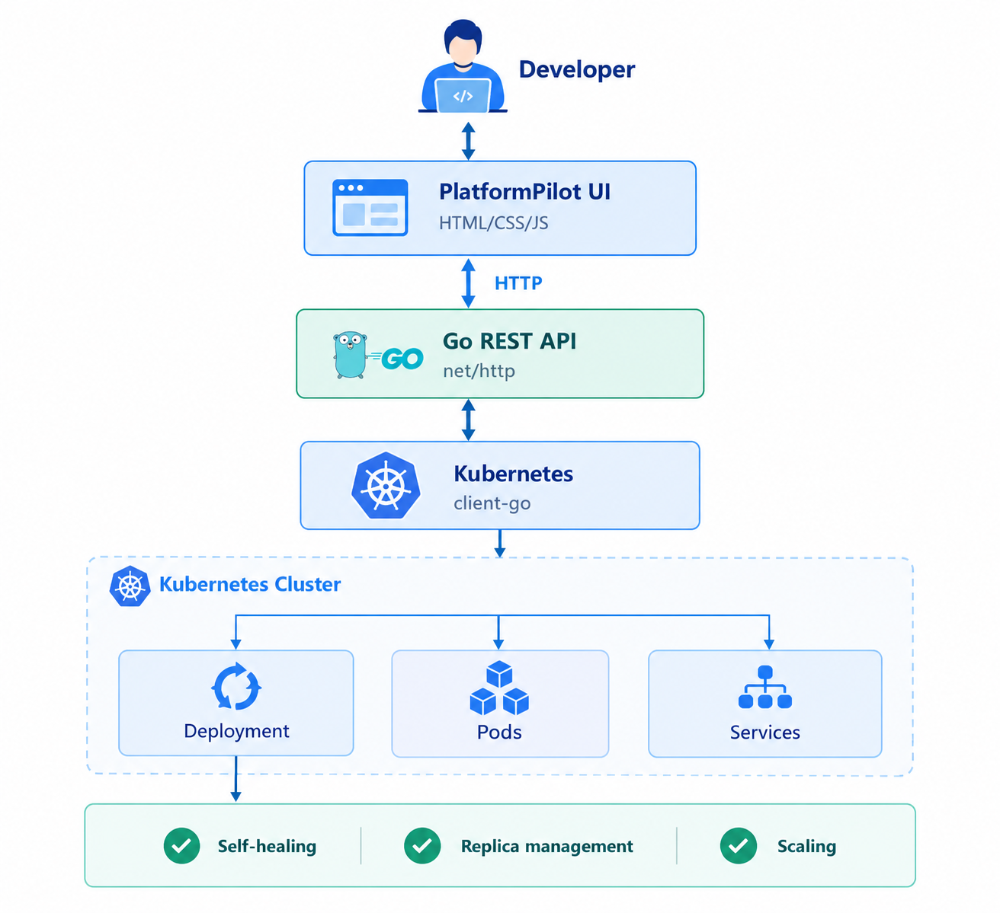

# PlatformPilot
----------------
Self-service Kubernetes platform for deploying and managing applications without requiring developers to use `kubectl` directly.

## Overview
-------------
PlatformPilot is an Internal Developer Platform (IDP) built with Go and Kubernetes.

The goal is to provide developers with a simple interface to deploy and manage Kubernetes applications while PlatformPilot handles the underlying Kubernetes resources.

Instead of asking developers to work directly with Kubernetes manifests and `kubectl`, they can use PlatformPilot to perform common application operations.

## Current Features

- Kubernetes connectivity using Go `client-go`
- Web-based dashboard
- Deploy applications
- Create Kubernetes Deployments
- Create Kubernetes Services
- View Kubernetes resources
- View Deployment status and replica availability
- Scale applications
- Delete Kubernetes resources
- Kubernetes Pod self-healing demonstration
- Protection for PlatformPilot system resources
- Health check endpoint

## Architecture

